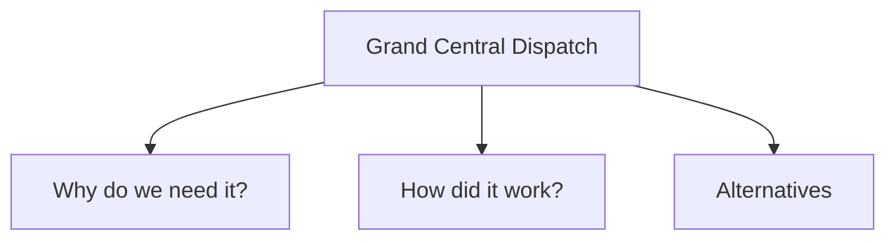
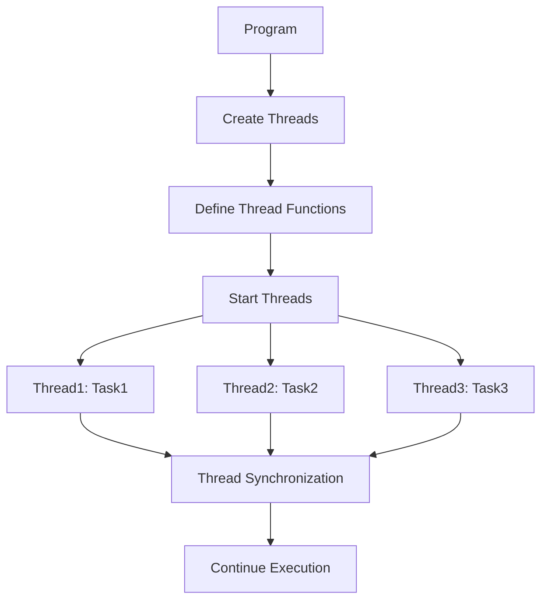
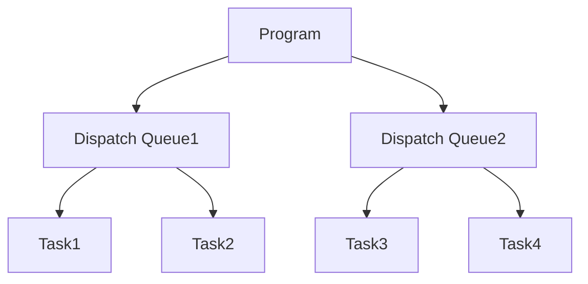

## What is Grand Central Dispatch?

> Dispatch, also known as Grand Central Dispatch (GCD), contains language features, runtime libraries, and system enhancements that provide systemic, comprehensive improvements to the support for concurrent code execution on multicore hardware in macOS, iOS, watchOS, and tvOS.

一個讓工程師可以更輕易配置**concurrent code**的框架

## What problem did **GCD** solve?

執行緒管理 | 人工 | GCD
---------|----------|---------
 (維護 / 開發)難度 | 較高  | 較低
 平均效能 | 1 | 1.3
 安全性 | 不一定 | 安全

## How did it Work?

GCD是一個讓我們可以不用直接操作Thread的API，我們只需要指定Task的**性質**，並將他加入適當的**DispatchQueue**，GCD就可以幫我們處理這些Task應該要在哪個Thread被執行。

### Before GCD



### After GCD



## Parallelism and Concurrency

> ### Explaination from WWDC2017 GCD
>
> - Parallelism
>
>   Simultaneous execution of closely related computations
> - Concurrency
>
>   Composition of independently executed tasks

## Queue Concept

當我們提交Task到DispatchQueue中，GCD會依照先進先出(FIFO)的規則依序執行我們的Task。

我們僅需要注意：

- 選擇對的DispatchQueue( Serial / Concurrent )
- 執行對的dispatching function( sync / async )

### DispatchQueue

#### Serial vs Concurrent

DispatchQueue Type | Serial | Concurrent
---------|:----------:|:---------:
 可預測 | 可以 | 不一定
 發生Race Condition | 不可能 | 可能
 完成Task的速度 | 慢 | 快

#### Sync vs async

> Dispatch Function is just a function that tells the queue how this task should be scheduled

```swift
let backgroundQueue = DispatchQueue.global()
backgroundQueue.sync {
  // Task1
  print("task1")
}

print("between sync")

backgroundQueue.async {
  // Task2
  print("task2")
}

// output:
// task1
// between sync
// task2
```

```swift
let backgroundQueue = DispatchQueue.global()
backgroundQueue.async {
  // Task1
  print("task1")
}

print("middle")

backgroundQueue.sync {
  // Task2
  print("task2")
}

print("bottom")

// output:
// between async
// task2
// after all async
// task1
```

```swift
let backgroundQueue = DispatchQueue.global()
backgroundQueue.async {
  // Task1
  print("small task done, on thread \(Thread.current)")
  backgroundQueue.sync {
    print("sync task, on thread \(Thread.current)")
    backgroundQueue.async {
      print("inside sync async task, on thread \(Thread.current)")
    }
  }
}

print("between async")

backgroundQueue.sync {
  // Task2
  print("task2")
}

print("after all async")

// output:
// between async
// task2
// after all async
// task1
```
