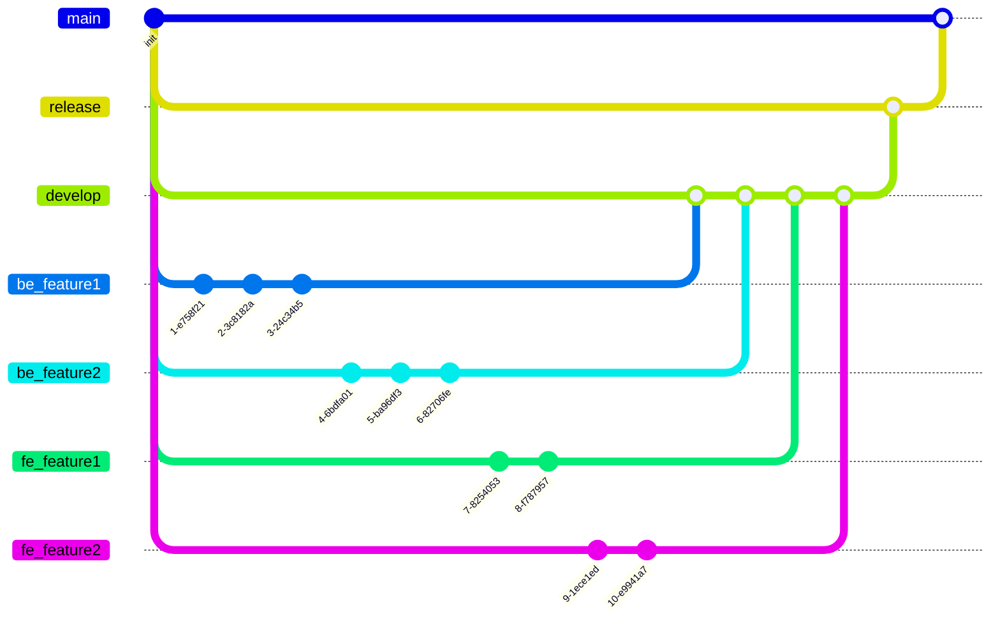

```mermaid
    gitGraph
       commit id: "init"
       branch release
       branch develop
       branch be_feature1
       branch be_feature2
       branch fe_feature1
       branch fe_feature2
       checkout be_feature1
       commit
       commit
       commit
       checkout be_feature2
       commit
       commit
       commit
       checkout fe_feature1
       commit
       commit
       checkout fe_feature2
       commit
       commit
       checkout develop
       merge be_feature1
       merge be_feature2
       merge fe_feature1
       merge fe_feature2
       checkout release
       merge develop
       checkout main
       merge release
```

```git
[type] title
body
footer
```