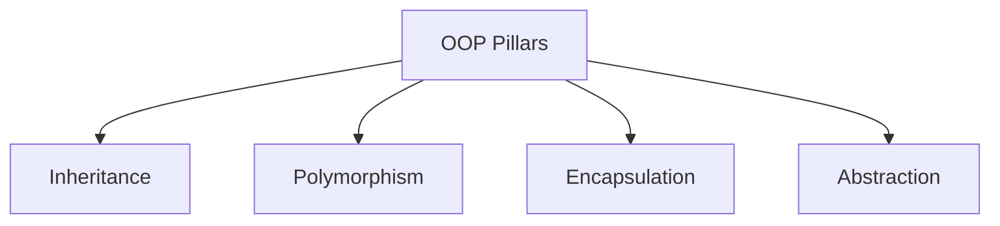

## Languages

- Python
- C#
- Java
- Ruby

## Pillars

1. Inheritance:
   1. code reusability
2. Polymorphism
   1. overriding methods in child classes
3. Encapsulation
   1. hide private interface, show with public
   2. access control
4. Abstraction

## Building blocks

- Classes
- Objects
- Methods
- Attributes